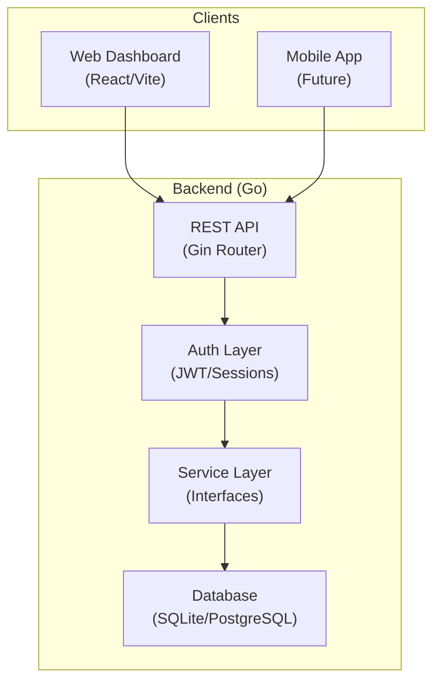
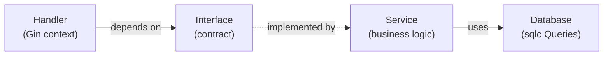
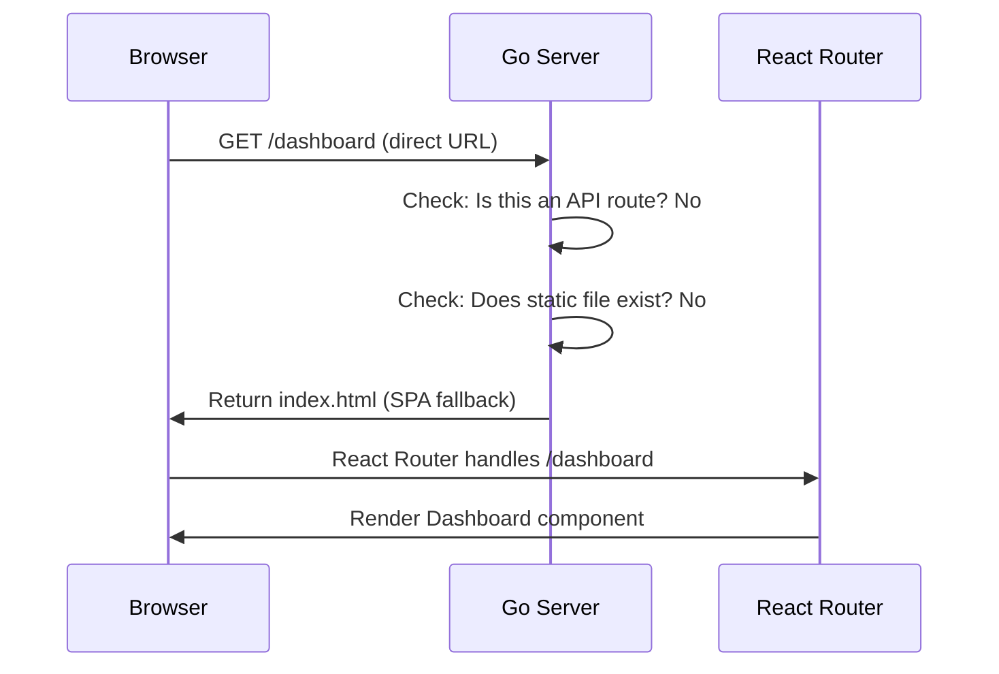

# Budgeting App Architecture

> A web dashboard with a backend designed for mobile app connectivity.

## 1. High-Level Overview



---

## 2. Technology Stack

### 2.1 Backend (`src/backend`)

| Layer | Technology | Rationale |
|-------|-----------|-----------|
| **Language** | Go 1.25.4 | Performance, concurrency, single-binary deployment |
| **Router** | Gin | High performance (40x standard lib), Express-like DX, excellent middleware |
| **Database** | PostgreSQL | Robust, feature-rich, production-grade |
| **Queries** | `sqlc` | Compile-time type-safe SQL queries |
| **Migrations** | `goose` | Versioned schema migrations (up/down) |
| **Auth** | Session-based (HttpOnly cookies) | Secure, XSS-resistant per BFF pattern |

### 2.2 Frontend (`src/frontend`) — Single Page Application

> **Architecture:** The frontend is a **Single Page Application (SPA)**. All routing happens client-side via React Router. The Go backend serves the static bundle and handles API requests only.

| Layer | Technology | Rationale |
|-------|-----------|-----------|
| **Framework** | React 18+ | Component model, state management, ecosystem |
| **Build Tool** | Vite | Fast HMR, native ES modules, optimized production builds |
| **Language** | TypeScript | Type safety, API contract enforcement |
| **Routing** | React Router | Client-side navigation, no full page reloads |
| **Styling** | CSS (vanilla or Tailwind) | Flexible, performant |
| **State** | TanStack Query | Server state caching and synchronization |

---

## 3. Project Structure

```
budgeting-app/
├── src/
│   ├── backend/
│   │   ├── cmd/
│   │   │   └── server/
│   │   │       └── main.go           # Entry point, DI wiring
│   │   ├── internal/
│   │   │   ├── database/             # sqlc generated code, migrations
│   │   │   ├── features/
│   │   │   │   ├── accounts/
│   │   │   │   │   ├── handler.go    # HTTP handlers (Gin)
│   │   │   │   │   ├── service.go    # Business logic implementation
│   │   │   │   │   └── interface.go  # Service interface
│   │   │   │   ├── transactions/
│   │   │   │   │   ├── handler.go
│   │   │   │   │   ├── service.go
│   │   │   │   │   └── interface.go
│   │   │   │   ├── bills/
│   │   │   │   │   ├── handler.go
│   │   │   │   │   ├── service.go
│   │   │   │   │   └── interface.go
│   │   │   │   └── auth/
│   │   │   │       ├── handler.go
│   │   │   │       ├── service.go
│   │   │   │       └── interface.go
│   │   │   └── shared/
│   │   │       ├── middleware/       # Auth, logging, recovery
│   │   │       └── config/           # App configuration
│   │   ├── go.mod
│   │   └── go.sum
│   │
│   └── frontend/
│       ├── src/
│       │   ├── app/              # App-wide routing/providers
│       │   ├── components/       # Shared UI components
│       │   ├── features/
│       │   │   ├── auth/         # Login/Register components & hooks
│       │   │   ├── accounts/     # Account lists, forms, hooks
│       │   │   ├── transactions/ # Transaction components
│       │   │   └── bills/        # Bill trackers
│       │   ├── hooks/            # Shared hooks
│       │   ├── lib/              # API and Utils
│       │   └── types/            # Shared types
│       ├── package.json
│       ├── vite.config.ts
│       └── tsconfig.json
│
├── specs/
├── docs/
└── artifacts/
```

---

## 4. Dependency Injection & Modular Architecture

> **Core Principle:** Dependencies flow downward. Handlers depend on services via **interfaces**, enabling testability and loose coupling.

### 4.1 Backend Injection (Layered)



### 4.2 Per-Feature Structure

Each feature module follows this structure:

```
features/accounts/
├── interface.go   # Service contract (what operations are available)
├── service.go     # Implementation (how operations work)
└── handler.go     # HTTP layer (Gin handlers, depends on interface)
```

### 4.3 Frontend modularity (Package by Feature)

The Frontend mirrors the Backend's feature-based structure to ensure scalability.

**Standard Feature Structure:**
```
src/features/accounts/
├── components/      # UI: AccountList.tsx, AccountForm.tsx
├── items/          # Hooks: useAccounts(), useCreateAccount() (The "Service" layer)
├── types/          # Feature-specific types
└── index.ts        # Public API
```

**"Dependency Injection" in React:**
Instead of Class constructors, we use **React Hooks** and **Context** as our injection mechanism.
*   **Service Layer equivalent**: Custom Hooks (e.g., `useAuth()`, `useTransactions()`) encapsulate business logic and API calls.
*   **Injection**: Components consume these hooks. We can swap implementations (e.g., for testing) by mocking the hook or providing a different Context.

### 4.3 Example: Accounts Feature

**`interface.go`** — Defines the contract:
```go
package accounts

import "context"

type Service interface {
    GetAll(ctx context.Context, userID string) ([]Account, error)
    GetByID(ctx context.Context, id string) (*Account, error)
    Create(ctx context.Context, input CreateAccountInput) (*Account, error)
    Update(ctx context.Context, id string, input UpdateAccountInput) error
    Delete(ctx context.Context, id string) error
}
```

**`service.go`** — Implements the interface:
```go
package accounts

type service struct {
    queries *database.Queries
}

func NewService(queries *database.Queries) Service {
    return &service{queries: queries}
}

func (s *service) GetAll(ctx context.Context, userID string) ([]Account, error) {
    // Implementation using s.queries
}
```

**`handler.go`** — Depends on interface only:
```go
package accounts

import "github.com/gin-gonic/gin"

type Handler struct {
    service Service  // Interface, not concrete type
}

func NewHandler(service Service) *Handler {
    return &Handler{service: service}
}

func (h *Handler) GetAll(c *gin.Context) {
    accounts, err := h.service.GetAll(c.Request.Context(), userID)
    // ...
}
```

### 4.4 Wiring in `main.go`

```go
func main() {
    // Infrastructure
    db := database.Connect()
    queries := database.New(db)

    // Services (implementations)
    accountsService := accounts.NewService(queries)
    billsService := bills.NewService(queries)

    // Handlers (depend on interfaces)
    accountsHandler := accounts.NewHandler(accountsService)
    billsHandler := bills.NewHandler(billsService)

    // Router
    r := gin.Default()
    r.GET("/api/accounts", accountsHandler.GetAll)
    r.POST("/api/accounts", accountsHandler.Create)
    // ...
}
```

---

## 5. Communication Protocol

| Aspect | Choice | Notes |
|--------|--------|-------|
| **Primary** | REST (JSON over HTTP/1.1) | Simple, debuggable, universal |
| **Future** | gRPC/Connect-RPC | For high-performance mobile clients |

### 5.1 API Routing Convention

```
/api/v1/...
  /auth/login
  /auth/logout
  /accounts
  /transactions
  /bills
  /reports
```

---

## 6. Authentication & Security

| Aspect | Implementation |
|--------|----------------|
| **Auth Strategy** | Session-based with HttpOnly cookies |
| **Password Hashing** | bcrypt |
| **CSRF Protection** | Double Submit Cookie pattern |
| **CORS** | Gin CORS middleware |
| **Data Isolation** | Service layer MUST inject `user_id` into every DB query |

## 7. Internationalization & Formatting

*   **Currency**: The system supports multi-currency accounts. The Frontend must format amounts based on the `currency` code (ISO 4217) associated with the account.
*   **Timezones**: Timestamps are stored in UTC (`TIMESTAMPTZ`). Frontend converts to local time.

---

## 7. Development Workflow

### 7.1 Docker Compose (Database)

PostgreSQL runs in Docker during development:

```yaml
# docker-compose.yml
services:
  db:
    image: postgres:16-alpine
    container_name: budgeting-db
    environment:
      POSTGRES_USER: budgeting
      POSTGRES_PASSWORD: budgeting
      POSTGRES_DB: budgeting
    ports:
      - "5432:5432"
    volumes:
      - postgres_data:/var/lib/postgresql/data

volumes:
  postgres_data:
```

**Start database:**
```bash
docker-compose up -d
```

### 7.2 Dual-Server Mode (Development)

| Component | Port | Command |
|-----------|------|---------|
| Go Backend | `:8080` | `go run ./cmd/server` |
| React Dev Server | `:5173` | `npm run dev` |

### 7.3 Single-Binary Mode (Production)

```bash
cd src/frontend && npm run build
cd src/backend && go build -o budgeting-app ./cmd/server
./budgeting-app
```

---

## 8. Key Dependencies

### Backend

| Package | Purpose |
|---------|---------|
| `github.com/gin-gonic/gin` | HTTP routing |
| `github.com/gin-contrib/cors` | CORS middleware |
| `github.com/sqlc-dev/sqlc` | SQL query code generation |
| `github.com/pressly/goose/v3` | Database migrations |
| `github.com/jackc/pgx/v5` | PostgreSQL driver |
| `golang.org/x/crypto/bcrypt` | Password hashing |

### Frontend

| Package | Purpose |
|---------|---------|
| `react`, `react-dom` | UI framework |
| `react-router-dom` | Client-side routing |
| `@tanstack/react-query` | Server state management |
| `vite`, `typescript` | Build tooling |

---

## 9. SPA Routing & Fallback Pattern

Since the frontend is an SPA, the Go backend must handle the "deep link" problem:



**Implementation:** Go's `NotFound` handler returns `index.html` for non-API, non-static requests, allowing React Router to manage client-side navigation.

---

## 10. Revision History

| Date | Version | Changes |
|------|---------|---------|
| 2026-01-09 | 1.4 | Go 1.25.4, PostgreSQL only, removed templ, added docker-compose |
| 2026-01-09 | 1.3 | Added Goose for migrations, clarified SQLC for queries |
| 2026-01-09 | 1.2 | Explicit SPA declaration, added SPA fallback pattern documentation |
| 2026-01-09 | 1.1 | Switched to Gin router, added DI pattern with handler/service/interface structure |
| 2026-01-09 | 1.0 | Initial architecture |
