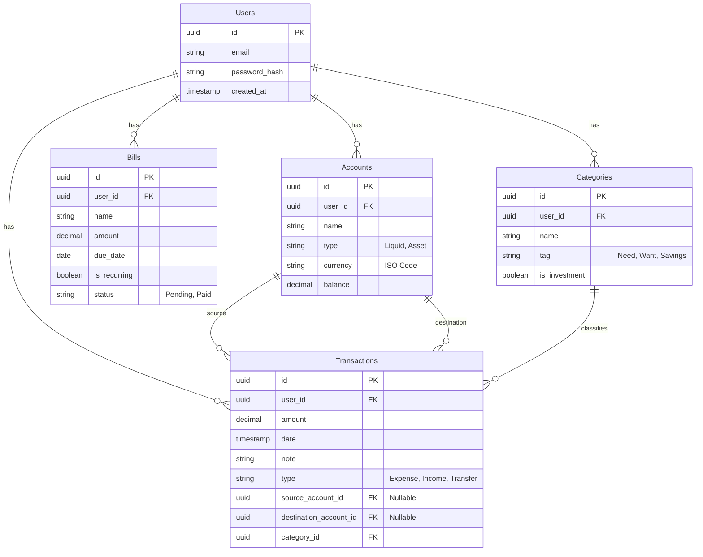

# Database Design

## 1. Overview
The database uses PostgreSQL. All tables are designed to strictly enforce Row-Level Security principles by including `user_id` as a foreign key where applicable.

---

## 2. Entity Relationship Diagram

---

## 3. Schema Definitions

### 3.1 Users
| Column | Type | Constraints | Description |
|---|---|---|---|
| `id` | UUID | PK | Unique identifier |
| `email` | VARCHAR | Unique, Not Null | User email |
| `password_hash` | VARCHAR | Not Null | Bcrypt hash |
| `created_at` | TIMESTAMPTZ | Default Now() | Account creation time |

### 3.2 Accounts
| Column | Type | Constraints | Description |
|---|---|---|---|
| `id` | UUID | PK | Unique identifier |
| `user_id` | UUID | FK -> Users.id | Owner |
| `name` | VARCHAR | Not Null | E.g., "BPI", "Cash" |
| `type` | VARCHAR | Not Null | `liquid` or `asset` |
| `currency` | VARCHAR | Not Null | ISO 4217 Code (e.g. USD, PHP) |
| `balance` | DECIMAL | Not Null | Current balance |

### 3.3 Categories
| Column | Type | Constraints | Description |
|---|---|---|---|
| `id` | UUID | PK | Unique identifier |
| `user_id` | UUID | FK -> Users.id | Owner |
| `name` | VARCHAR | Not Null | E.g., "Food", "Rent" |
| `tag` | VARCHAR | Not Null | `need`, `want`, `savings` |
| `is_investment` | BOOLEAN | Default False | If true, triggers transfer logic |

### 3.4 Transactions
| Column | Type | Constraints | Description |
|---|---|---|---|
| `id` | UUID | PK | Unique identifier |
| `user_id` | UUID | FK -> Users.id | Owner |
| `amount` | DECIMAL | Not Null | Transaction value |
| `date` | TIMESTAMPTZ | Not Null | Transaction time |
| `note` | TEXT | | Optional description |
| `type` | VARCHAR | Not Null | `expense`, `income`, `transfer` |
| `source_account_id` | UUID | FK -> Accounts.id | Nullable (for income) |
| `destination_account_id` | UUID | FK -> Accounts.id | Nullable (for expense) |
| `category_id` | UUID | FK -> Categories.id | Classification |

### 3.5 Bills
| Column | Type | Constraints | Description |
|---|---|---|---|
| `id` | UUID | PK | Unique identifier |
| `user_id` | UUID | FK -> Users.id | Owner |
| `name` | VARCHAR | Not Null | Bill name |
| `amount` | DECIMAL | Not Null | Amount due |
| `due_date` | DATE | Not Null | Due date recurrence |
| `is_recurring` | BOOLEAN | Default False | |
| `status` | VARCHAR | Default 'pending' | `pending`, `paid` |
